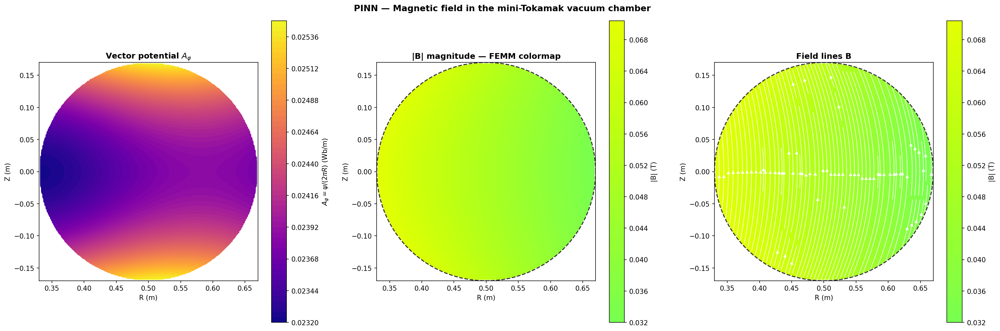
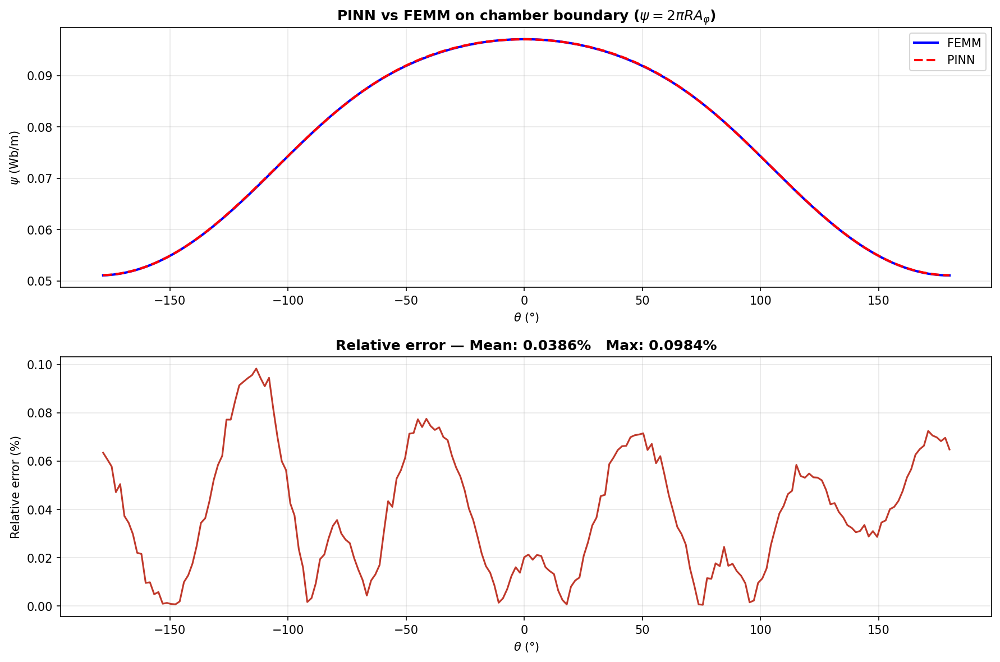
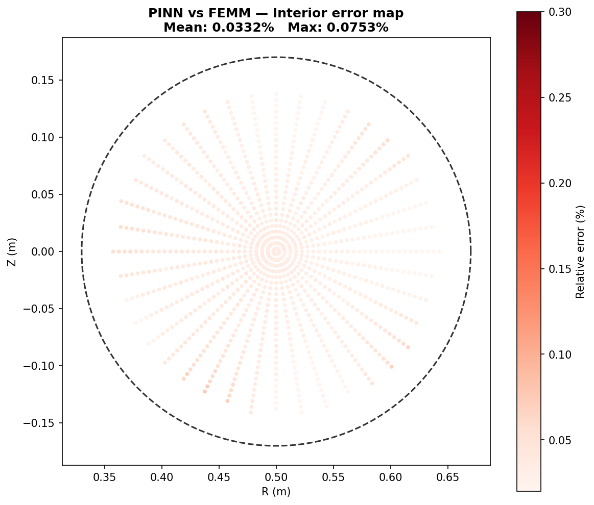

# Physics-Informed Neural Network for Magnetic Confinement in a Mini-Tokamak

[](https://www.python.org/)
[](https://pytorch.org/)
[](https://www.femm.info/)
[](LICENSE)

A Physics-Informed Neural Network (PINN) that learns the magnetic flux function **ψ(R,Z)** inside the vacuum chamber of a mini-Tokamak, validated against FEMM finite-element simulations.

The network achieves **<0.04% boundary error** and **0.033% interior error** relative to the FEM reference, trained in **7.4 minutes** on a single RTX 3060 Ti GPU.

---


*From left to right: vector potential Aφ = ψ/(2πR), magnetic field magnitude |B|, and field lines inside the vacuum chamber.*

---

## Table of Contents

- [Overview](#overview)
- [Physics Background](#physics-background)
- [Model Geometry](#model-geometry)
- [Method](#method)
- [Results](#results)
- [Repository Structure](#repository-structure)
- [Installation](#installation)
- [Usage](#usage)
- [Mathematical Derivation](#mathematical-derivation)

---

## Overview

This project combines **finite-element simulation** (FEMM) with **physics-informed machine learning** (PyTorch) to study magnetic confinement in a simplified Tokamak geometry.

The setup consists of:
- A **toroidal coil** (N=100 turns, I=1000 A) — the main field source
- Two **poloidal coils** (N=50 turns, I=500 A each) — positioned above and below the torus, shaping the field

The PINN learns to predict the complete magnetic field at any point inside the vacuum chamber without solving the FEM problem at inference time, making it orders of magnitude faster once trained.

**Key features:**
- PDE residual computed via PyTorch autograd — no finite differences, no mesh
- Three-component loss: physics (PDE) + boundary data + interior data
- Full FEMM validation pipeline included
- Reproducible FEMM model via Lua script

---

## Physics Background

Under axisymmetry (∂/∂φ = 0), Maxwell's equations reduce to a single 2nd-order PDE for the magnetic flux function ψ(R,Z) in the vacuum region (J = 0):

$$\frac{\partial^2 \psi}{\partial R^2} - \frac{1}{R}\frac{\partial \psi}{\partial R} + \frac{\partial^2 \psi}{\partial Z^2} = 0$$

where ψ = 2πR·Aφ is the magnetic flux through a disk of radius R (Aφ is the azimuthal component of the vector potential A).

Once the PINN has learned ψ(R,Z), the magnetic field components are recovered analytically:

$$B_R = -\frac{1}{2\pi R}\frac{\partial \psi}{\partial Z}, \qquad B_Z = \frac{1}{2\pi R}\frac{\partial \psi}{\partial R}$$

For the full derivation from Maxwell's equations to the PDE, see [math_derivation.md](math_derivation.md).

> **Note on FEMM convention:** FEMM in axisymmetric mode returns the flux function ψ = 2πR·Aφ, not the vector potential Aφ directly. The PDE for ψ has a **minus** sign in the (1/R) term — opposite to the Aφ equation. Confusing these two leads to a ~5× error in Bz.

---

## Model Geometry

All dimensions in meters, centered at (R₀=0.50, Z=0):

| Region | Shape | R range | Z range | Material | Current |
|---|---|---|---|---|---|
| Vacuum chamber | Circle | r ≤ 0.17 m | — | Air | J = 0 |
| Toroidal coil | Annulus | 0.17–0.22 m | — | Copper | N=100, I=1000 A |
| Poloidal coil (top) | Square | 0.51–0.59 m | +0.36–+0.44 m | Copper | N=50, I=500 A |
| Poloidal coil (bottom) | Square | 0.51–0.59 m | −0.44–−0.36 m | Copper | N=50, I=500 A |
| Dirichlet domain | Rectangle | 0–1.20 m | ±0.80 m | Air | A = 0 (BC) |

The PINN operates inside the vacuum chamber disc (r ≤ 0.17 m from center).

---

## Method

### Network architecture

A fully-connected MLP with:
- **Input:** (R_norm, Z_norm) — coordinates normalized to [−1, 1]
- **Hidden layers:** 6 × 100 neurons with Tanh activation
- **Output:** ψ_norm — flux function normalized to [0, 1]
- **Parameters:** 50,901

Tanh is chosen over ReLU because the PDE requires second-order derivatives, which vanish for piecewise-linear activations.

### Loss function

$$\mathcal{L} = \lambda_{\text{pde}} \cdot \mathcal{L}_{\text{pde}} + \lambda_{\text{bc}} \cdot \mathcal{L}_{\text{bc}} + \lambda_{\text{data}} \cdot \mathcal{L}_{\text{data}}$$

| Term | Weight | Description |
|---|---|---|
| L_pde | λ=10 | PDE residual at random interior points (enforces physics) |
| L_bc | λ=5 | MSE vs FEMM data on the chamber boundary (200 points) |
| L_data | λ=20 | MSE vs FEMM data in the chamber interior (~1131 points) |

PDE derivatives are computed exactly via `torch.autograd.grad` with `create_graph=True`, enabling second-order differentiation through the network.

### Training

- **Phase 1:** 12,000 iterations, lr = 1×10⁻³ (Adam)
- **Phase 2:** 8,000 iterations, lr = 5×10⁻⁴ (fine-tuning)
- **Hardware:** Single RTX 3060 Ti GPU
- **Time:** ~7.4 minutes

---

## Results

| Metric | Value |
|---|---|
| Boundary error (mean) | 0.039 % |
| Interior error (mean) | 0.033 % |
| \|B\| range | 0.033 – 0.070 T |
| Training time | 7.4 min |
| Final loss | 9.76 × 10⁻⁶ |


*PINN (red dashed) vs FEMM (blue solid) along the chamber boundary. Maximum relative error: 0.1%.*


*Relative error across the entire vacuum chamber. Mean: 0.033%.*

The poloidal coils introduce a non-zero BR component (antisymmetric in Z) and a parabolic BZ profile along the axis — both correctly captured by the PINN purely through the boundary conditions extracted from FEMM.

---

## Repository Structure
```
PINN-Tokamak-Confinement/
│
├── README.md
├── math_derivation.md
├── requirements.txt
├── LICENSE
│
├── pinn_tokamak.py
├── pyfemm_extraction.py
├── femm_tokamak.lua
│
├── model/
│   └── tokamak.fem
│
├── data/
│   ├── boundary_data.csv
│   └── interior_data.csv
│
└── results/
├── 01_loss_curves.png
├── 02_pinn_fields.png
├── 03_pinn_vs_femm.png
├── 04_interior_error.png
└── 05_axial_profile.png
```
---

## Installation

```bash
git clone https://github.com/erikjonperez/PINN-Tokamak-Confinement.git
cd PINN-Tokamak-Confinement
pip install -r requirements.txt
```

FEMM 4.2 is required only if you want to re-run the simulation and extract new data (Windows only). For training with the provided data, only PyTorch + pandas + matplotlib are needed.

---

## Usage

### Train with provided data (recommended)

```bash
python pinn_tokamak.py
```

Results are saved to `results/`.

### Full pipeline from FEMM

**Step 1:** Build the FEMM model

**Step 2:** Extract training data
```bash
python pyfemm_extraction.py
```

**Step 3:** Train the PINN
```bash
python pinn_tokamak.py
```

### Cloud GPU (Vast.ai or similar)

```bash
pip install matplotlib pandas torch
python pinn_tokamak.py
```

No additional dependencies beyond PyTorch are required for training.

---

## Mathematical Derivation

See [math_derivation.md](math_derivation.md) for the full step-by-step derivation covering:
1. Maxwell → vector Poisson equation
2. Axial symmetry → scalar field Aφ(R,Z)
3. Vector Laplacian in cylindrical coordinates → PDE for Aφ
4. Stokes' theorem → flux function ψ = 2πR·Aφ
5. Change of variables → PDE for ψ
6. Recovery of B from ψ
7. Normalization and chain rule for PINN derivatives
8. Loss function design

---

## License

MIT License. See [LICENSE](LICENSE).

---

## Author

**Erik Jon Pérez Mardaras** — AI Engineer

[LinkedIn](https://linkedin.com/in/erikjonperez) · [GitHub](https://github.com/erikjonperez)

# Mathematical Derivation

Full step-by-step derivation of the governing PDE and the PINN formulation for the mini-Tokamak magnetic confinement problem.

---

## Step 1 — Maxwell's equations

We start from the magnetostatic form of Maxwell's equations (no time variation):

$$\nabla \times \mathbf{H} = \mathbf{J}$$
$$\nabla \cdot \mathbf{B} = 0$$

With the constitutive relation B = μ₀H in vacuum, Ampère's law becomes ∇×B = μ₀J.

---

## Step 2 — Vector potential A

Since ∇·B = 0, there exists a vector field A such that B = ∇×A. Applying the Coulomb gauge (∇·A = 0):

$$\boxed{-\nabla^2 \mathbf{A} = \mu_0 \mathbf{J}}$$

In the vacuum (J = 0): ∇²A = 0.

---

## Step 3 — Axial symmetry

The Tokamak has revolution symmetry around Z (∂/∂φ = 0). All currents flow azimuthally: J = Jφ(R,Z) ê_φ. Therefore A also has only the azimuthal component:

$$\mathbf{A} = A_\varphi(R,Z)\,\hat{e}_\varphi$$

The 3D problem reduces to finding the scalar field Aφ(R,Z) in the 2D meridional plane.

---

## Step 4 — PDE for Aφ in cylindrical coordinates

The vector Laplacian for the φ-component is not the same as the scalar Laplacian applied to Aφ. The unit vector ê_φ rotates as you move in R, generating an extra term:

$$(\nabla^2 \mathbf{A})_\varphi = \frac{\partial^2 A_\varphi}{\partial R^2} + \frac{1}{R}\frac{\partial A_\varphi}{\partial R} + \frac{\partial^2 A_\varphi}{\partial Z^2} - \frac{A_\varphi}{R^2}$$

Setting this to zero in the vacuum:

$$\boxed{\frac{\partial^2 A_\varphi}{\partial R^2} + \frac{1}{R}\frac{\partial A_\varphi}{\partial R} + \frac{\partial^2 A_\varphi}{\partial Z^2} - \frac{A_\varphi}{R^2} = 0}$$

---

## Step 5 — Stokes' theorem: flux function ψ

By Stokes' theorem, the magnetic flux through a disk of radius R is:

$$\Phi = \iint_S \mathbf{B} \cdot d\mathbf{S} = \oint_C \mathbf{A} \cdot d\mathbf{l} = A_\varphi \cdot 2\pi R$$

We define the magnetic flux function (stream function):

$$\psi(R,Z) = 2\pi R \cdot A_\varphi(R,Z)$$

Its level curves coincide with the magnetic field lines in the R-Z plane.

> **FEMM convention:** FEMM in axisymmetric mode returns ψ = 2πR·Aφ (verified numerically: A_femm/(2πR) ≈ 0.0195 with <1% variation across the domain).

---

## Step 6 — PDE for ψ

Substituting Aφ = ψ/(2πR) into the Aφ PDE and simplifying:

$$\frac{\partial A_\varphi}{\partial R} = \frac{1}{2\pi}\frac{R\,\partial\psi/\partial R - \psi}{R^2}$$

$$\frac{\partial^2 A_\varphi}{\partial R^2} = \frac{1}{2\pi}\left[\frac{\partial^2\psi/\partial R^2}{R} - \frac{2\,\partial\psi/\partial R}{R^2} + \frac{2\psi}{R^3}\right]$$

After substitution and cancellation of terms, dividing by 1/(2πR):

$$\boxed{\frac{\partial^2 \psi}{\partial R^2} - \frac{1}{R}\frac{\partial \psi}{\partial R} + \frac{\partial^2 \psi}{\partial Z^2} = 0}$$

**Critical difference from the Aφ PDE:** the sign of the (1/R) term is **minus** (not plus), and the ψ/R² term vanishes. This is the PDE the PINN enforces.

---

## Step 7 — Recovering B from ψ

From B = ∇×A with A = [ψ/(2πR)] ê_φ:

$$\boxed{B_R = -\frac{1}{2\pi R}\frac{\partial \psi}{\partial Z}}$$

$$\boxed{B_Z = \frac{1}{2\pi R}\frac{\partial \psi}{\partial R}}$$

These are computed exactly via PyTorch autograd — no discretization.

---

## Step 8 — Normalization and chain rule

The PINN uses normalized coordinates:

$$R_n = \frac{2(R - R_{\min})}{R_{\max} - R_{\min}} - 1, \quad Z_n = \frac{2(Z + a)}{2a} - 1, \quad \psi_n = \frac{\psi - \psi_{\min}}{\psi_{\max} - \psi_{\min}}$$

Scale factors: $s_R = 2/(R_{\max}-R_{\min})$, $s_Z = 2/(2a)$, $s_\psi = \psi_{\max}-\psi_{\min}$.

Chain rule to recover real derivatives from normalized ones:

$$\frac{\partial \psi}{\partial R} = s_\psi \cdot s_R \cdot \frac{\partial \psi_n}{\partial R_n}, \qquad \frac{\partial^2 \psi}{\partial R^2} = s_\psi \cdot s_R^2 \cdot \frac{\partial^2 \psi_n}{\partial R_n^2}$$

---

## Step 9 — PINN loss function

$$\mathcal{L} = \lambda_{\text{pde}} \cdot \mathcal{L}_{\text{pde}} + \lambda_{\text{bc}} \cdot \mathcal{L}_{\text{bc}} + \lambda_{\text{data}} \cdot \mathcal{L}_{\text{data}}$$

**Physics loss** — PDE residual at random interior points:

$$\mathcal{L}_{\text{pde}} = \frac{1}{N}\sum_i \left(\frac{\partial^2 \psi}{\partial R^2} - \frac{1}{R_i}\frac{\partial \psi}{\partial R} + \frac{\partial^2 \psi}{\partial Z^2}\right)^2_{(R_i,Z_i)}$$

**Boundary loss** — matches FEMM values on the chamber boundary:

$$\mathcal{L}_{\text{bc}} = \frac{1}{N}\sum_j \left(\psi_\theta(R_j,Z_j) - \psi_{\text{FEMM}}(R_j,Z_j)\right)^2$$

**Data loss** — matches FEMM values inside the chamber:

$$\mathcal{L}_{\text{data}} = \frac{1}{N}\sum_k \left(\psi_\theta(R_k,Z_k) - \psi_{\text{FEMM}}(R_k,Z_k)\right)^2$$

Weights: λ_pde = 10, λ_bc = 5, λ_data = 20.

---

## Summary

| Quantity | Expression |
|---|---|
| Governing PDE | ∂²ψ/∂R² − (1/R)·∂ψ/∂R + ∂²ψ/∂Z² = 0 |
| Flux function | ψ = 2πR·Aφ |
| Radial field | BR = −(1/2πR)·∂ψ/∂Z |
| Vertical field | BZ = (1/2πR)·∂ψ/∂R |
| PINN objective | ψ_θ(R,Z) ≈ ψ(R,Z) |
| Training loss | L = 10·L_pde + 5·L_bc + 20·L_data |

